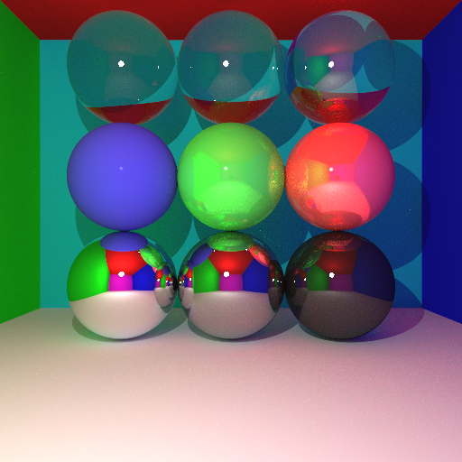
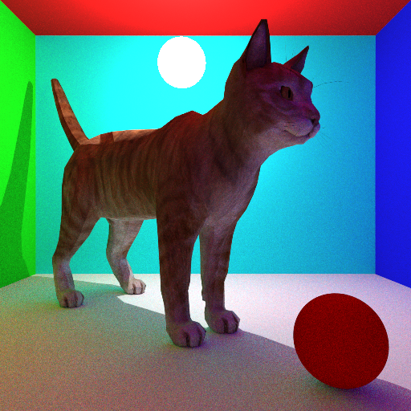

# ray-tracing-project

## Description

Ce projet est un projet de ray tracing en C++ réalisé dans le cadre du MOS "Informatique Graphique" de 3e année à Centrale Lyon.
C'est un projet qui permet de faire des rendus 3D réalistes en simulant le comportement de la lumière dans une scène donnée contenant des objets tels que des sphères, des sources de lumières ou des maillages.

## Visuels

## Auteur
Timothée Barry

## Fonctionnalités
- Objets (sphères, maillages, sphères lumineuses)
- Gestion des ombres portées
- Gestion de l'éclairage indirect (via Monte Carlo)
- Gestion des maillages (textures, BVH, transormations géométriques, lissage de Phong)
- Gestion des matériaux (diffus, spéculaire, réfractif, Blinn Phong)
- Effets optiques (Anti Aliasing, DOF, correction gamma)
- Gestion des sources de lumières (ponctuelles, directionnelles, sphères lumineuses)

